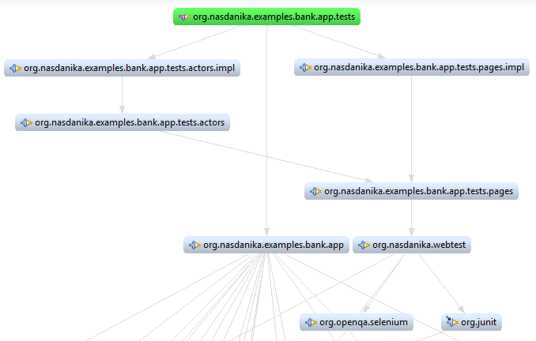
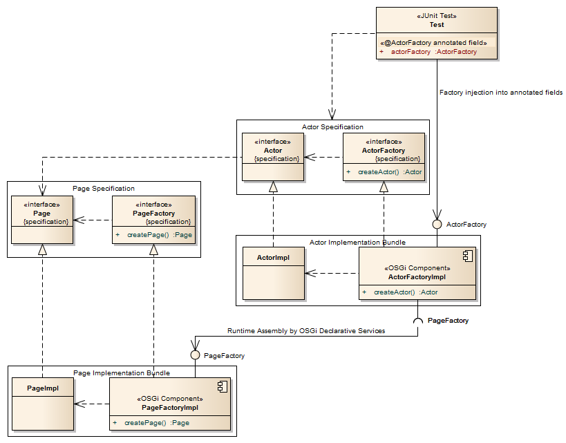

WebTest
====

[Nasdanika WebTest](https://github.com/Nasdanika/server/tree/master/org.nasdanika.webtest) is a Web/Mobile UI automated testing and documentation generation framework
built on [Selenium WebDriver](http://www.seleniumhq.org/projects/webdriver/) and
[JUnit](http://junit.org/).  

[Nasdanika WebTest presentation on SlideShare](http://www.slideshare.net/PavelVlasov2/nasdanika-webtest)

The framework provides JUnit test runner and test suite runner classes which 
generate an [HTML report](http://www.nasdanika.org/examples/test-report/) with detailed 
screenshots after test/suite execution. Screenshots are collected transparently by 
intercepting invocations of test, actor, and page methods. Collected screenshots can be used for educational purposes - to show
UI flows, and for quality reviews - to quickly explore how the target applications behaves on different browsers, devices and screen sizes. 

The framework encourages declarative development style leveraging annotations and separation of actor/page specification and implementation. 
Such separation enables parallelization of development of tests and actor/page implementations against page specifications. 
It also allows to write page/actor implementation-independent tests and run them against different implementations. The report provides 
information about page/actor methods coverage which allows to track development progress in terms of delivered functionality.

The framework also provides several annotations which allow to customize test execution and report generation.  

## Concepts
* **Test case** - a JUnit 4 test case class which implements [WebTest](http://www.nasdanika.org/server/apidocs/org.nasdanika.webtest/target/site/apidocs/org/nasdanika/webtest/WebTest.html) 
interface and runs with [NasdanikaWebTestRunner](http://www.nasdanika.org/server/apidocs/org.nasdanika.webtest/target/site/apidocs/org/nasdanika/webtest/NasdanikaWebTestRunner.html). 
The test case shall obtain an instance of WebDriver in ``@Before`` method and also create proxies of actor and page factories by invoking 
``NasdanikaTestRunner.proxyActorFactory()`` and ``NasdanikaTestRunnar.proxyPageFactory()``. It also shall quit the driver in ``@After`` method.
* **Test method** - a JUnit test method, NasdanikaTestRunner take a screenshot before and after test method execution. Test methods may operate 
with web driver directly, but it is recommended to use actor and page layers of abstraction. 
* **Page** - an interface/class pair which provides a facade for test/actor code to interact with a Web page. It abstracts test/actor code from 
details of the page implementation. For WebTest to be able to record page method invocations and take snapshots, pages must be defined as 
interfaces extending [Page](http://www.nasdanika.org/server/apidocs/org.nasdanika.webtest/target/site/apidocs/org/nasdanika/webtest/Page.html) interface. See 
[Page Object](https://code.google.com/p/selenium/wiki/PageObjects) for additional information.
* **PageFactory** - a factory interface for creating pages.
* **Actor** - an interface/class pair which groups fine-grained operations on a page or a group of pages into coarse-grained *business* methods.
* **ActorFactory** - a factory interface for creating actors. 

## Annotations
* **[ActorFactory](http://www.nasdanika.org/server/apidocs/org.nasdanika.webtest/target/site/apidocs/org/nasdanika/webtest/ActorFactory.html)** - A field annotation to inject actor factory OSGi service into a test class.
* **[Context](http://www.nasdanika.org/server/apidocs/org.nasdanika.webtest/target/site/apidocs/org/nasdanika/webtest/Context.html)** - can be added to page implementation classes and methods to declaratively switch context in [ContextAware](https://selenium.googlecode.com/git/docs/api/java/org/openqa/selenium/ContextAware.html) web drivers, e.g. switch between a web context and the native  contexts in a hybrid mobile application.
* **[Description](http://www.nasdanika.org/server/apidocs/org.nasdanika.webtest/target/site/apidocs/org/nasdanika/webtest/Description.html)** - allows to attach a description to class/method
to appear in the report.
but included into the report. Tests which don't call any page or actor methods are automatically marked as pending. 
* **[Link](http://www.nasdanika.org/server/apidocs/org.nasdanika.webtest/target/site/apidocs/org/nasdanika/webtest/Link.html)** - link to an external resource. For example, actor interfaces may link to story [protagonist](http://www.nasdanika.org/server/apidocs/org.nasdanika.story/target/site/apidocs/org/nasdanika/story/Protagonist.html) implementations such as [persona](http://www.nasdanika.org/products/story/apidocs/org.nasdanika.story/target/site/apidocs/org/nasdanika/story/Persona.html), and test methods may link
to story [acceptance criteria](http://www.nasdanika.org/server/apidocs/org.nasdanika.story/target/site/apidocs/org/nasdanika/story/AcceptanceCriterion.html).
* **[Links](http://www.nasdanika.org/server/apidocs/org.nasdanika.webtest/target/site/apidocs/org/nasdanika/webtest/Links.html)** - Composite link - a collection of Link annotations. In Java 8+ simply use multiple ``Link`` annotations.
* **[PageFactory](http://www.nasdanika.org/server/apidocs/org.nasdanika.webtest/target/site/apidocs/org/nasdanika/webtest/PageFactory.html)** - A field annotation to inject page factory OSGi service into a test class.
* **[Pending](http://www.nasdanika.org/server/apidocs/org.nasdanika.webtest/target/site/apidocs/org/nasdanika/webtest/Pending.html)** - test methods with this annotation are not executed
* **[Report](http://www.nasdanika.org/server/apidocs/org.nasdanika.webtest/target/site/apidocs/org/nasdanika/webtest/Report.html)** - can be applied to a test class - case or suite - 
to customize report generation.
* **[ResultsModel](http://www.nasdanika.org/server/apidocs/org.nasdanika.webtest/target/site/apidocs/org/nasdanika/webtest/ResultsModel.html)** - can be applied to a test class or a test suite class to write [test results model](http://www.nasdanika.org/server/apidocs/org.nasdanika.webtest.model/target/site/apidocs/index.html) XML/XMI file and screenshots to disk. The results can then be:
  * Stored in a binary repository or published to a network.
  * Wrapped into an OSGi/Equinox bundle. The test results bundle can be:
    * Packaged with the product which was tested and test results can become a part of the product documentation served by the documentation route.
    * Packaged with/deployed to the [Nasdanika Information Center](https://github.com/Nasdanika/information-center).
  * Used to generate reports. 
* **[Sketch](http://www.nasdanika.org/server/apidocs/org.nasdanika.webtest/target/site/apidocs/org/nasdanika/webtest/Sketch.html)** - test, actor and page methods and page classes may use this annotation to specify sketches/wireframes/mockups to be used
as screenshots when SketchWebDriver instances is used by the test..
* **[Sketches](http://www.nasdanika.org/server/apidocs/org.nasdanika.webtest/target/site/apidocs/org/nasdanika/webtest/Sketches.html)** - Composite sketch - a collection of Wait annotations. In Java 8+ simply use multiple ``Sketch`` annotations.
* **[Screenshot](http://www.nasdanika.org/server/apidocs/org.nasdanika.webtest/target/site/apidocs/org/nasdanika/webtest/Screenshot.html)** - Method annotation which allows to suppress taking screenshots or introduce a delay before taking a screenshot - 
this can be useful when testing mobile applications in emulators.
* **[Service](http://www.nasdanika.org/server/apidocs/org.nasdanika.webtest/target/site/apidocs/org/nasdanika/webtest/Service.html)** - A field annotation to inject an OSGi service into a test class, e.g. a service providing data for a parameterized test.
* **[Title](http://www.nasdanika.org/server/apidocs/org.nasdanika.webtest/target/site/apidocs/org/nasdanika/webtest/Title.html)** - applies to test/actor/page classes and methods to customize
how given class/method appears in the report. If this annotation is not provided the title is constructed from class/method name by splitting class/method name by camel case character class, capitalizing the first word and lower-casing the others. E.g. a title for
``myVeryComplexTest()`` method would be ``My very complex test``.  
* **[Wait](http://www.nasdanika.org/server/apidocs/org.nasdanika.webtest/target/site/apidocs/org/nasdanika/webtest/Wait.html)** - page implementation class methods and page classes may use this annotation to 
wait for a certain condition (e.g. visibility of a particular page element loaded using AJAX) before taking a screenshot and executing the method or initializing the page class.
* **[Waits](http://www.nasdanika.org/server/apidocs/org.nasdanika.webtest/target/site/apidocs/org/nasdanika/webtest/Waits.html)** - Composite wait - a collection of Wait annotations. In Java 8+ simply use multiple ``Wait`` annotations.


## Screenshots
### Suppressing 
Setting ``NASDANIKA_WEBTEST_TAKE_SCREENSHOTS`` environment variable to ``no`` or ``false`` suppresses screenshot taking. It can be used on developers' machines and in some build configurations to speed-up test execution.  

### Customizing
Test, actor and page classes may implement ``org.openqa.selenium.TakesScreenshot`` interface to customize how screenshot is taken. 

## Sketches and wireframes

With WebTest it is possible to "capture" sketches or wireframes instead of screenshots. This technique can be used to elaborate and communicate application screen flows and screen structure before the application UI is available for testing. This is how it works:   

* [Sketch](http://www.nasdanika.org/server/apidocs/org.nasdanika.webtest/apidocs/org/nasdanika/webtest/Sketch.html) annotation can be used on test, actor, and page methods to specify sketches to be used instead of screenshots before and after method invocation, and on exception. It can also be used on page classes for before/after page construction "screenshots". Sketches can be PNG images, [PlantUML](http://plantuml.com) diagram specs (e.g. [Salt](http://plantuml.com/salt.html) wireframes), or any resources which can be loaded by a a web browser. In the case of PlantUML wireframes Eclipse users may benefit from [PlantUML Eclipse plug-in](http://plantuml.com/eclipse.html) which allows to preview salt wireframes. Methods and classes can have more than one Sketch annotation with different selectors to match different SketchWebDriver instances. E.g. ``sketch`` selector may match hand-drawn sketches, ``wireframe`` - wireframes, and ``mockup`` - mock-ups respectively. Or ``sketch/web`` may match browser sketches and ``sketch/mobile`` - mobile sketches. It can be further elaborated into, say ``sketch/mobile/portrait`` and ``sketch/mobile/landscape``, dimensions, etc.   

* [SketchWebDriver](http://www.nasdanika.org/server/apidocs/org.nasdanika.webtest/apidocs/org/nasdanika/webtest/SketchWebDriver.html) is a marker interface telling the framework to use sketches instead of screenshots. Instances of SketchWebDriver can be created with [WebTestUtil](http://www.nasdanika.org/server/apidocs/org.nasdanika.webtest/apidocs/org/nasdanika/webtest/WebTestUtil.html).createSketchWebDriver(String selector) method. Tests and UI driver classes shall use sketch web driver instances as discriminators to switch between real tests and sketching (see below).

* ``WebTestUtil.takeSketch()`` method can be used to capture a sketch during test method execution.

### Example: Parameterized tests with different drivers

This section explains one possible use of sketching. In this example there is a parameterized test class with 
different WebDriver classes as parameters. The page factory declares two WebDriver type constants - ``WEB_SKETCH_DRIVER`` and ``MOBILE_SKETCH_DRIVER`` with ``sketch/web`` and ``sketch/mobile`` selectors respectively. 
The test uses these constants as parameters.

When a regular web driver is used the page factory creates page classes which actually use WebDriver API's to navigate through the web application. However, when ``WEB_SKETCH_DRIVER`` or ``MOBILE_SKETCH_DRIVER`` driver is passed to the page factory, it creates page classes which use sketches. The framework matches the driver selector to the annotation selector to choose a proper sketch. 

This approach keeps test and actor methods the same for all types of drivers, only page implementations change. The report contains sketches along with screenshots, which allows to compare design to implementation side-by-side. Also, initially only sketch web drivers can be used, as was mentioned earlier. 

In a more advanced scenario more sketch drivers can be used, e.g. ``WEB_SKETCH_DRIVER`` and ``WEB_WIREFRAMES_DRIVER`` with, say, sketches being hand-drawn images and wireframes being images created with PlantUML Salt, Sparx Enterprise Architect UI modeling diagrams or any other tool, or static HTML pages.

## Report structure

*Important: A report generated by Nasdanika WebTest uses AJAX and therefore cannot be browsed over the file:// protocol*

The report has a left side navigation panel and a details panel.

### Left side panel
The left side which contains a list of test cases with sub-lists of individual tests under them. If there are too
many test cases and tests then tests are not shown by default and are displayed on mouse over the test case.

Click on items in the navigation panel loads item details to the details panel.

### Details panel

#### Summary
Report summary displays three tabs:
* Tests - a table of test cases with statistics. Click on test case name loads test case details to the details panel.
* Actors - a table of actors with coverage. Click on actor name loads actor details.
* Pages - a table of pages with coverage. Click on page name loads page details.

#### Test case details
Test case details displays test case name and description and a table of tests in the case with success/fail/error/pending status, description,
and execution time. A mouse click on the test name loads test details.

#### Test details
Test details include a carousel with screenshots taken during the test execution and an indented table of invocations of actor and page 
methods. 

The carousel can be navigated with left and right chevrons or by clicking on slide indicators in the indicator bar on the bottom of the page. 
Each slide has a title which displays method type icon - test, actor or page and method title. For methods with @Description annotation a comment
icon is displayed on the right. Mouse over this icon opens a tooltip with method description.

Slides in the carousel are scaled-down if necessary. A click on the slide in the carousel opens it in a dialog with 100% zoom. Mouse over left
and right the image displays chevrons to navigate to previous/next slide in the sequence. 

The method call tree table contains method name with an icon indicating whether it is a test, actor, or page method, method description and
execution time. A click on the method name scrolls the carousel to the screenshot associated with the method and scrolls the page to the 
carousel. Note that Nasdanika WebTest detects and eliminates duplicate screenshots, therefore one screenshot can be associated with several 
methods and a screenshot title can differ from the name clicked.   

In the case of failure or error the details cell contains error type and message in addition to method description. A mouse click on the 
error opens its stack trace. Another click hides the stack trace.

#### Actor details
A table of actor methods with descriptions and number of invocations for each method.

#### Page details
A table of page methods with descriptions and number of invocations for each method.

## Usage scenarios

### Single application
This scenario was realized in [an early version Example Bank Application](https://github.com/Nasdanika/examples/tree/07d6388c8d6447d9bab6a774f0e806e2260aed23). The diagram below depicts a partial plug-in
dependency graph:

 

#### [org.nasdanika.examples.bank.app.tests](https://github.com/Nasdanika/examples/tree/07d6388c8d6447d9bab6a774f0e806e2260aed23/org.nasdanika.examples.bank.app.tests) 
This bundle is a fragment for [org.nasdanika.examples.bank.app](https://github.com/Nasdanika/examples/tree/07d6388c8d6447d9bab6a774f0e806e2260aed23/org.nasdanika.examples.bank.app). Tests can be executed 
either as an OSGi application ``TestRunner`` (e.g. in Eclipse IDE), or as Maven/Tycho eclipse-test-plugin (e.g. during an automated build by Jenkins).
This bundle contains tests which operate with actors and pages. The code snippet below shows part of the [Registration](https://github.com/Nasdanika/examples/blob/07d6388c8d6447d9bab6a774f0e806e2260aed23/org.nasdanika.examples.bank.app.tests/src/org/nasdanika/examples/bank/app/tests/Registration.java) test: 
```java
@RunWith(NasdanikaTestRunner.class)
@FixMethodOrder(MethodSorters.NAME_ASCENDING)
@Description("Tests of registration scenarios")
public class Registration implements WebTest {
	
	private WebDriver driver;
	
	@Override
	public WebDriver getWebDriver() {
		return driver;
	}
	
	private BankActorFactory actorFactory;

	@Before
	public void setUp() throws Exception {
        driver = new FirefoxDriver(); // new ChromeDriver();
        driver.manage().timeouts().pageLoadTimeout(3, TimeUnit.SECONDS);
        BankPageFactory pageFactory = NasdanikaTestRunner.proxyPageFactory(new BankPageFactoryImpl(driver, "http://localhost:8080"));
        actorFactory = NasdanikaTestRunner.proxyActorFactory(new BankActorFactoryImpl(pageFactory));
	}
	
	@Test
	@Description("Successful registration")
	public void aHappyPath() throws Exception {
		Guest guest = actorFactory.createGuest();
		Actor customer = guest.signUp("jDoe", "John Doe", "J0hn$D03", "J0hn$D03");
		Assert.assertTrue(customer instanceof Customer);
		Assert.assertTrue(customer.getCurrentPage() instanceof CustomerHome);
		Assert.assertEquals("John Doe", ((CustomerHome) customer.getCurrentPage()).getBanner());
	}
``` 

#### [org.nasdanika.examples.bank.app.tests.actors](https://github.com/Nasdanika/examples/tree/07d6388c8d6447d9bab6a774f0e806e2260aed23/org.nasdanika.examples.bank.app.tests.actors) 
This bundle contains actors and actor factory specifications. E.g. [Guest](https://github.com/Nasdanika/examples/blob/07d6388c8d6447d9bab6a774f0e806e2260aed23/org.nasdanika.examples.bank.app.tests.actors/src/org/nasdanika/examples/bank/app/tests/actors/Guest.java) actor is defined as:
```java
@Description("Unauthenticated user")
public interface Guest extends Actor {
	
	/**
	 * 
	 * @param user
	 * @param password
	 * @return Actor for the authenticated user (Customer) if log-in succesful, 
	 * self otherwise.
	 */
	@Description("Enter Online ID and Password and click 'Sign in' button.")
	Actor signIn(String onlineId, String password);

	/**
	 * Registers new customer.
	 * @param onlineId
	 * @param name
	 * @param password
	 * @param passwordConfirmation
	 * @return Customer if sign-up successful, Guest otherwise.
	 */
	Actor signUp(String onlineId, String name, String password, String passwordConfirmation);

}
``` 

#### [org.nasdanika.examples.bank.app.tests.actors.impl](https://github.com/Nasdanika/examples/tree/07d6388c8d6447d9bab6a774f0e806e2260aed23/org.nasdanika.examples.bank.app.tests.actors.impl) 
This bundle contains actors and actor factory implementations. Actor implementations operate on page specifications as demonstrated in the snippet below, which shows [GuestImpl](https://github.com/Nasdanika/examples/blob/07d6388c8d6447d9bab6a774f0e806e2260aed23/org.nasdanika.examples.bank.app.tests.actors.impl/src/org/nasdanika/examples/bank/app/tests/actors/impl/GuestImpl.java).signuUp() method:
```java
@Override
public Actor signUp(
		String onlineId, 
		String name, 
		String password,
		String passwordConfirmation) {
	GuestHome home = factory.getPageFactory().createGuestHome();
	home.open();
	currentPage = home;
	Page signUpResult = home.clickSignUp()
			.waitToAppear()
			.enterOnlineId(onlineId)
			.enterName(name)
			.enterPassword(password)
			.enterPasswordConfirmation(passwordConfirmation)
			.clickSignUp();

	if (signUpResult instanceof CustomerHome) {
		Assert.assertEquals(name, ((CustomerHome) signUpResult).getBanner());
		return factory.createCustomer((CustomerHome) signUpResult);
	} 
	return this;
}
``` 

#### [org.nasdanika.examples.bank.app.tests.pages](https://github.com/Nasdanika/examples/tree/07d6388c8d6447d9bab6a774f0e806e2260aed23/org.nasdanika.examples.bank.app.tests.pages) 
This is a page specification bundle, it contains page and page factory interfaces, e.g. [GuestHome](https://github.com/Nasdanika/examples/blob/07d6388c8d6447d9bab6a774f0e806e2260aed23/org.nasdanika.examples.bank.app.tests.pages/src/org/nasdanika/examples/bank/app/tests/pages/guest/GuestHome.java) page interface:
```java
public interface GuestHome extends Page {

	/**
	 * Navigates to the home page.
	 */
	void open();

	void enterOnlineId(String onlineId);

	void enterPassword(String password);

	/**
	 * Clicks sign-in button.
	 * @return Customer home if sign-in was successful, this page if input validation fails, or authentication failed dialog 
	 * if incorrect credentials were provided.
	 */
	Page clickSignIn();

	SignUpDialog clickSignUp();	
}
``` 

#### [org.nasdanika.examples.bank.app.tests.pages.impl](https://github.com/Nasdanika/examples/tree/07d6388c8d6447d9bab6a774f0e806e2260aed23/org.nasdanika.examples.bank.app.tests.pages.impl) 
This is a page implementation bundle. Page implementations use Selenium WebDriver to drive browsers as shown in a fragment of [GuestHomeImpl](https://github.com/Nasdanika/examples/blob/07d6388c8d6447d9bab6a774f0e806e2260aed23/org.nasdanika.examples.bank.app.tests.pages.impl/src/org/nasdanika/examples/bank/app/tests/pages/impl/guest/GuestHomeImpl.java) below:
```java
public class GuestHomeImpl implements GuestHome {

	private BankPageFactoryImpl factory;
	private WebDriver webDriver;

	public GuestHomeImpl(WebDriver webDriver) {
		this.webDriver = webDriver;
	}

	public void setFactory(BankPageFactoryImpl factory) {
		this.factory = factory;
	}

	private WebElement onlineId;
	private WebElement password;
	private WebElement signInButton;

	private WebElement signUpMenuItem;

	@Override
	public void enterOnlineId(String onlineId) {
		this.onlineId.sendKeys(onlineId);
	}

	@Override
	public void enterPassword(String password) {
		this.password.sendKeys(password);
	}
```

### Software product lines
The approach of separation of test logic into five layers - test, actor, page, actor implementation, page implementation - has a number of benefits.
In the single application and a small team scenario the same people may work on on specifications and implementations and some of the benefits are:
* Focus - developers may "wear different hats" at specification and implementation phases focusing on "What" at specification time and "How" at implementation time.
* Communication with business users - although Java is not a BDD language, it should not be much more difficult for a non-programmer to understand ``Actor signIn(String onlineId, String password)`` than ``As a non-authenticated user (Guest) I want to to sign-in into the system by providing online ID and password``, 
especially taking into account that the latter phrase can be placed into ``@Description`` annotation in order to clarify what the method does.
* Possible generation of specifications from, say, UML use case diagrams, BDD specs, or Excel spreadsheets.
* Documentation - application UI flows are automatically documented by tests taking screenshots. 
* Screenshots provide an opportunity for an additional visual inspection by people other than testers.
* Declarative assembly of test suites with different implementations even in the same test run - actor/page factory filters are patterns which can contain {0}...{n} tokens expanded with parameter values for parameterized tests. It allows to select
different actor factory implementations based on parameter, e.g. [Appium](http://appium.io/) implementation when testing iOS device, [Selendroid](http://selendroid.io/) implementation when testing
an older Android device, and a regular Selenium implementation for testing in a browser.

In the case of a larger organization which uses software product lines approach to build multiple applications for different regions and lines
of business the layered approach to UI testing is even more beneficial:  
* Creation of foundation shared reusable Actor, Pages and Test libraries:
  * Enforces consistent experience across the application portfolio.
  * Reduces time-to-market and effort through reuse.
* Separation of interface and implementation:
  * Allows multiple teams to work in parallel on implementation of actors/tests and page implementations against the same page specifications, e.g.
    * Analysts define page and maybe actor specifications. Or maybe actor specifications are defined by one group and page specifications are
    elicited from the actor specifications by (an)other group(s).
    * Testers write actor and test implementations against the specification.
    * Application developers implement application functionality and page implementations to test that functionality, because they are the people
    most knowledgeable in the application/page internals.    
    
The process outlined above is similar to the [Java Community Process](https://www.jcp.org/en/home/index), where a standard body defines a 
specification (e.g. JDBC or JMS) then software vendors develop servers and drivers implementing the specification, and application developers develop their 
systems against the specification. Continuing analogy with the JCP, a tests suite serves the role of a [Technology Compatibility Kit (TCK)](http://en.wikipedia.org/wiki/Technology_Compatibility_Kit).
In outsourcing scenarios a tests suite can be developed by the client organization and provided to the contractor organization. Actor/Page coverage reports may be used to track development progress.

The software product lines scenario is implemented in the current version of the examples application:
* Page and actor specifications and implementations reside in [examples-bank-ui-driver](https://github.com/Nasdanika/examples-bank-ui-driver) repository. They are independent of 
tests and of the application code. In general, specification and implementations shall be different components possibly produced by different teams and there might be multiple
implementations of actor/page specifications - e.g. implementations for different devices or different flavors of UI (e.g. region or LOB-specific variations).
* The application and tests reside in [examples](https://github.com/Nasdanika/examples) repository. Tests may reside in a different repository and have no dependency on the
application code or actor/page implementations, only on actor/page specifications. 

The diagram below demonstrates dependencies and assembly of page and actor specifications, implementations, and tests:

          
    
#### Guidelines
##### Use OSGi dynamic services to look-up page/actor factories. 
In order to make tests independent of actor/page implementations the whiteboard patterns shall be used to lookup implementations by specifications.
It becomes especially important in the case of multi-module system with possibly multiple actor and pages bundles.

ActorFactory and PageFactory annotations implement the whiteboard pattern for factories and inject OSGi factory services into tests. Typically only actor factories shall be injected into tests, and actor components providing
factory services shall in turn shall be wired to page factory services. In cases where there is no actor layer page factories can be directly injected into tests.

The code snippet below shows injection of actor factory into a test:
```java
@ActorFactory
public BankActorFactory actorFactory;
```

The actor factory component uses page factory service:
```xml
<?xml version="1.0" encoding="UTF-8"?>
<scr:component xmlns:scr="http://www.osgi.org/xmlns/scr/v1.1.0" activate="activate" immediate="true" name="Bank Actor Factory">
   <implementation class="org.nasdanika.examples.bank.ui.driver.actors.impl.BankActorFactoryImpl"/>
   
   <reference 
   		bind="setPageFactory" 
   		cardinality="1..1" 
   		interface="org.nasdanika.examples.bank.ui.driver.pages.BankPageFactory" 
   		name="BankPageFactory" 
   		policy="static"/>
   		
   <service>
      <provide interface="org.nasdanika.examples.bank.ui.driver.actors.BankActorFactory"/>
   </service>
</scr:component>
```

[NasdanikaWhiteBoardTestSuite](https://github.com/Nasdanika/server/blob/master/org.nasdanika.webtest/src/org/nasdanika/webtest/NasdanikaWhiteBoardWebTestSuite.java) class 
is an extension of a JUnit Suite class. In addition to collecting tests from @Suite annotation, it also loads tests from ``org.nasdanika.webtest.test:test`` extensions.
It allows to have multiple test bundles and declaratively combine them into test suites. For example, if a banking system was assembled with the mortgages module (bundle/feature), then a test suite for it shall include mortgage tests bundle or feature.

Wiring of test and factory implementation bundles shall be done declaratively:
* In ``pom.xml`` if tests are executed by Maven/Tycho.
* In the product configuration if tests are built and executed as Eclipse products.

##### Factories shall be stateless and factory methods shall take WebDriver parameter
In the single application scenario described above factories are instantiated explicitly and WebDriver is passed as a parameter to factory
constructor. In the case of factories implemented as OSGi services this approach wouldn't work and WebDriver shall be passed as a parameter
to factory methods creating actors and pages, possibly with additional parameter - e.g. actor factories may take additional parameters for selecting an appropriate page factory for a test.

### [One Web](http://www.w3.org/2006/Talks/0404-sb-ctia-mwi/Overview.html#(8)) scenarios
We live in the age when the same UI application shall run (and be tested) on a multitude of different devices, screen sizes, orientations, pixel densities, etc.
This section describes several ways to address device variability.

#### [Responsive design](http://en.wikipedia.org/wiki/Responsive_web_design)
A responsive web page may behave differently on different devices. For example, [Bootstrap NavBar](http://getbootstrap.com/components/#navbar) collapses on narrow
devices. In simple situations it can be addressed by using conditional statements as in a code snippet shown below:
```java
if (!this.onlineId.isDisplayed() && navBarToggleButton.isDisplayed()) {
	navBarToggleButton.click();
	webDriverWait.until(ExpectedConditions.visibilityOf(this.onlineId));
}
```  
If conditional logic becomes too complex, different page implementations can be created and some sort of selection algorithm to select 
appropriate implementation, e.g.
* If page implementations reside in the same bundle and are created by the same page factory, then page factory methods shall take an argument
allowing to select page implementation or make selection using existing arguments, e.g. retrieve page size from the WebDriver.
* If page implementations reside in different bundles then there are the following options available:
  * Each page factory creates and returns a page instance only if the page is compatible with the target device/driver, otherwise it returns null. Page factory services
  are iterated by the test or actor implementation and the first non-null result is used.
  * Same as above, but page factories are sorted in the order of specificity using certain factory service properties and iterated from the most specific to the most generic.
  * Hub factory - similar to above, but iteration is done by a hub factory implementation. Actor/test code uses a filter to bind to a factory with role "hub", and
  the hub factory uses a filter to iterate over factories with role "node". 

#### [Adaptive design](http://en.wikipedia.org/wiki/Adaptive_web_design)
An adaptive web application may behave differently on different clients. For example, an insurance quote wizard may be 3-pages on a large device and
5 pages on a small, while taking all the same input fields.
 
This kind of variability may be addressed by having multiple page specifications and implementations and a single
actor specification with multiple implementations for different devices - the small device implementation will use a factory for small 
pages and will enter quote data into 5 pages, while the large device implementation will use large pages factory and will enter quote data into
3 pages.

In more complex cases where variability cannot be abstracted at the actor level, the [strategy pattern](http://en.wikipedia.org/wiki/Strategy_pattern) at the test level can be used, 
e.g. by having test interface specification and multiple implementations selected similarly to actors/pages based on the target device.

#### Mobile applications
Tests might be shared/reused between web applications and mobile applications by using different web drivers (e.g. [Selendroid](http://selendroid.io/) for Android applications, 
and [ios-driver](http://ios-driver.github.io/ios-driver/) for iOS applications) and different page/actor implementations for different targets.  
   
### Integration
Although the primary purpose of building actor/page libraries is to use and re-use them in testing activities, it is also possible to use them 
for other purposes. 

For example, there is a software system which has a suite of web tests, but doesn't have an API interface - it was not in the budget, it is
not ready yet, it requires a lot of approvals to expose it through the corporate firewall, ... (you name it). And one of partner companies wants to
access your system in an automated way, e.g. they have a BPM solution which shall log-in to your system and place an order, or download 
recent transactions. In this scenario you can share your actor/page libraries with the partner. If/when an API becomes available, you may
provide (if it is feasible) actors implementation which doesn't use pages anymore, but uses the API instead.
     